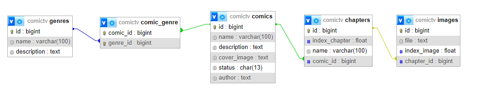
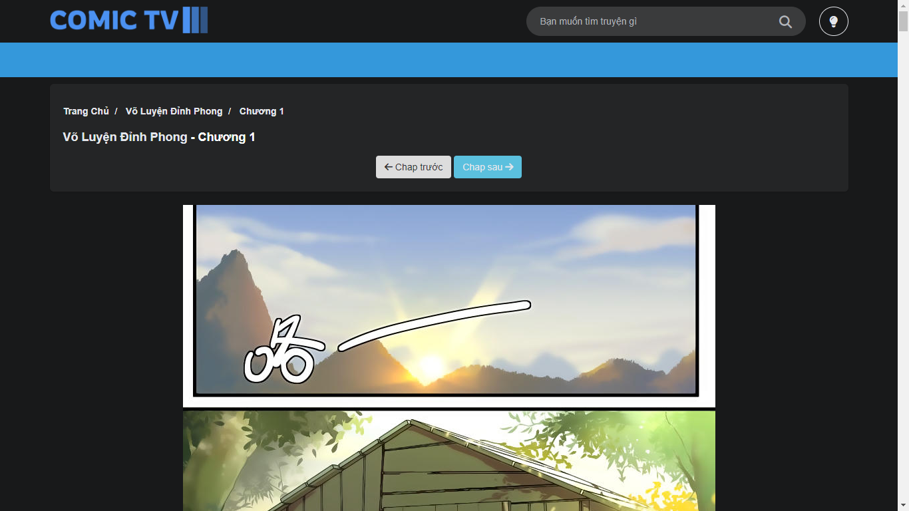

# Project học phần Công nghệ Web (CT275)

Học kỳ 2, Năm học 2022-2023

**MSSV 1** : B2014634

**Họ tên SV 1**: Lâm Chấn Vũ

**MSSV 2**: B2014621

**Họ tên SV 2**: Lê Văn Tính

**Lớp học phần**: CT27502

**Tên dự án**: Xây dựng trang web đọc truyện tranh

## Cơ sở dữ liệu

## Preview Images

### Trang chủ

### Trang chủ - nền tối

### Thông tin truyện

### Đọc truyện

### Các giao diện Admin

